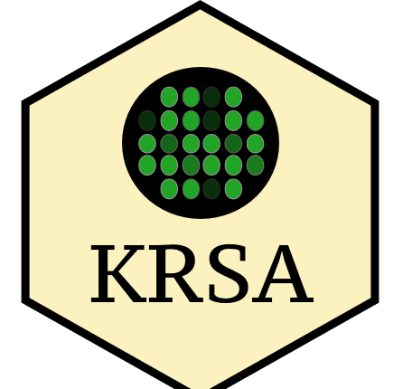
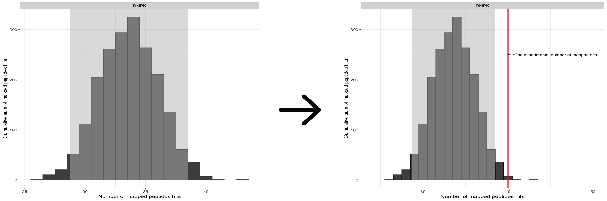
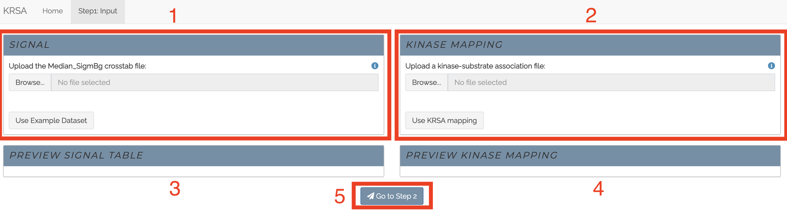
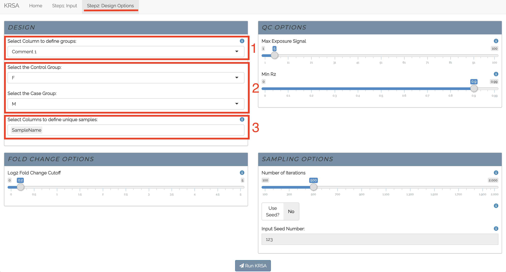
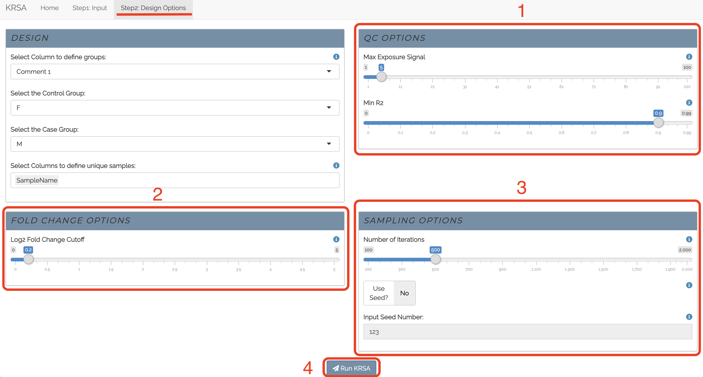
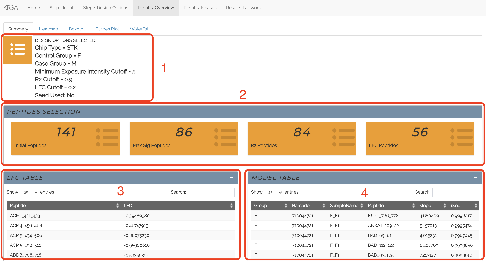
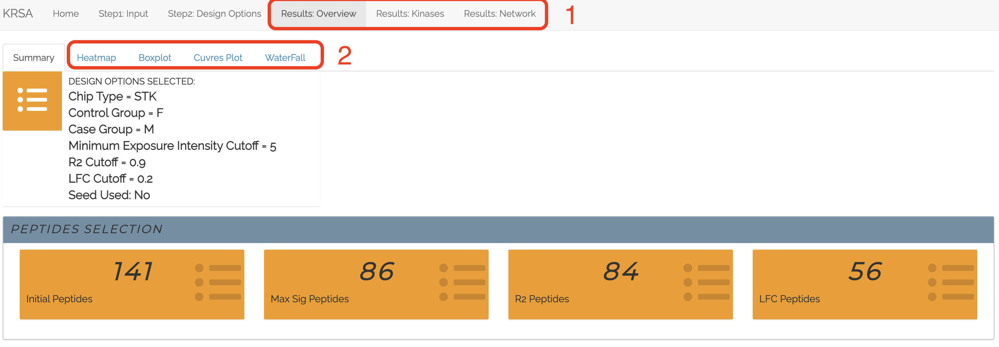

## KRSA

Kinome Random Sampling Analyzer, or KRSA, is an R package and a R Shiny
application that automates many of the steps required to analyze
[PamChip](https://pamgene.com/technology/) datasets, including peptide
filtering, random sampling, heatmap generation, and kinase network
generation. This new software makes analyzing kinome array datasets
accessible and eliminates much of the human workload that the previous
method required. More importantly, KRSA represents the results in a
bigger biological context by visualizing altered kinome signaling
networks instead of individual kinases.

Learn more about the KRSA R package:

More info on the PamStation12 platform can be found here:
[PamGene](https://pamgene.com/)   ————————————————————————

## Access

The web application is freely accessible here:
[Link](https://kalganem.shinyapps.io/KRSA/)

KRSA R package repo: [KRSA Package](https://github.com/kalganem/KRSA)

KRSA preprint is available here:
[Paper](https://www.biorxiv.org/content/10.1101/2020.08.26.268581v1)

------------------------------------------------------------------------

## Workflow

      
————————————————————————

## Random Sampling Approach

###### Running Random Sampling

   

###### Calculating Mean, Standard Deviations, and Z Scores

##   

## Input Files

The user-supplied kinase-peptide association file and the raw kinome
array data file are selected as input. The kinase-peptide associations
should be based on the known/predicted interactions found in databases
like GPS 3.0 and Kinexus Phosphonet. Expected inputs should be formatted
as shown in the example files: data/datasets/DLPFC_MvsF_STK.txt and
data/sup/FinalMappingSTK.txt.     ————————————————————————

## Interface and Use

We wanted to have a user friendly interface, so we’ve designed the KRSA
app to have a navbar at the top that takes you to different steps of the
analysis. As you start the app, there will be only two tabs (Home and
Step1: input). As you go through the app more tabs will appear.  
*Most inputs and options have an info icon
, when clicked more
information will be displayed*  

## Tabs

### Home

This is the home page of the app. It has information about KRSA and the
app workflow. It also has a subset of publications that have used KRSA.
When you click on a publication, the abstract of the paper will show up
and a link to PubMed.

  

### Step1: Input

This is the first step of using the KRSA app. This tab lets you either
upload a [BioNavigator](https://pamgene.com/technology/) Crosstab view
file or use the built-in example dataset. You also need to either upload
a kinase-substrate mapping file or use the built-in curated KRSA mapping
file.

1.  Box to upload the BioNavigator Crosstab view file or use the
    built-in example dataset

2.  upload a kinase-substrate mapping file or use the built-in curated
    KRSA mapping file

3.  After the input file is uploaded successfully (or the built-in
    example dataset is used), a preview of the newly formatted table
    will be shown here.

4.  After the kinase-substrate mapping file is uploaded successfully (or
    the built-in KRSA curated file is used), a preview of the
    kinase-substrate table will be shown here.

5.  After all files are uploaded, you can click this button to proceed
    to the next step.

  

### Step2: Design Options:

This tab is used to control the selection of samples and parameters to
run KRSA.

1.  Here is the option to select the column the will define the
    different grouping in the sample set (typical columns are
    *SampleName* or *Comment 1*)

2.  Options to select the Control and Case groups

3.  Here is the option to select the column (or columns) the will
    generate unique IDs for each sample. (This will create a new column
    in your data by pasting the values found the columns that are
    selected.

1.  **QC Options:** Here you select the QC options that will be used to
    filter out peptides.

2.  **Fold Change Options:** a slider to set the log2 fold change cutoff
    that will be used to extract differentially phosphorylated peptides.

3.  **Sampling Options:** Here you set the number of iterations used in
    the random sampling analysis. and, optionally, you can select a seed
    number that can be used later to reproduce the results.

4.  After all the selections requirement are satisfied, this button will
    run KRSA using the selected parameters.

  

#### Results Overview:

This tab will show a summary of the parameters that were selected and
contains sub-panels that will show different figures.

1.  **Summary Box:** A summary of the parameters that were selected
    based on the previous step

2.  **Peptide Selection:** This will show the number of peptides after
    each filtration step (QC steps, and LFC). When hovered over the
    boxes, more information will be displayed

3.  **LFC Table:** This will show the log2 fold change table. (a
    download button is available at the bottom of the table)

4.  **Model Table:** This will show the linear fit model output for each
    peptide and sample. (a download button is available at the bottom of
    the table)

  

1.  **Results Tabs:**

    -   **Results Overview:** Described above

    -   **Results Kinase:**

        -   **Kinase Table:** This will show final kinase table with Z
            scores for each kinase that was calculated using the random
            sampling approach.

        -   **Kinase Histogram:** a figure based on the random sampling
            analysis for each kinase

        -   **Reverse KRSA:** a figure that will plot the LFCs for all
            peptides that are mapped to the top kinase hits.

    -   **Results Network:** This will show the kinase network model and
        options

2.  **Subset Panels:** These show different plots to represent the data

    -   **Summary:** Described above

    -   **Heatmap:** This will a heatmap that represents the signal
        intensity of peptides and the selected samples. It has options
        for clustering and normalization.

    -   **Boxplot:** This will show a boxplot that represents the signal
        intensity of peptides and the selected samples as boxplot to
        determine global signals.

    -   **Curves Plot:** The linear fit model is represented here for
        each peptides and colored by groups

    -   **Waterfall:** this figure represent the log2 fold change values
        for peptides that passed the QC filtration steps   
        ————————————————————————

# Contact

For technical issues, please start a new issue on this repo.

For biological interpretation questions, please email:
<khaled.alganem@rockets.utoledo.edu>
